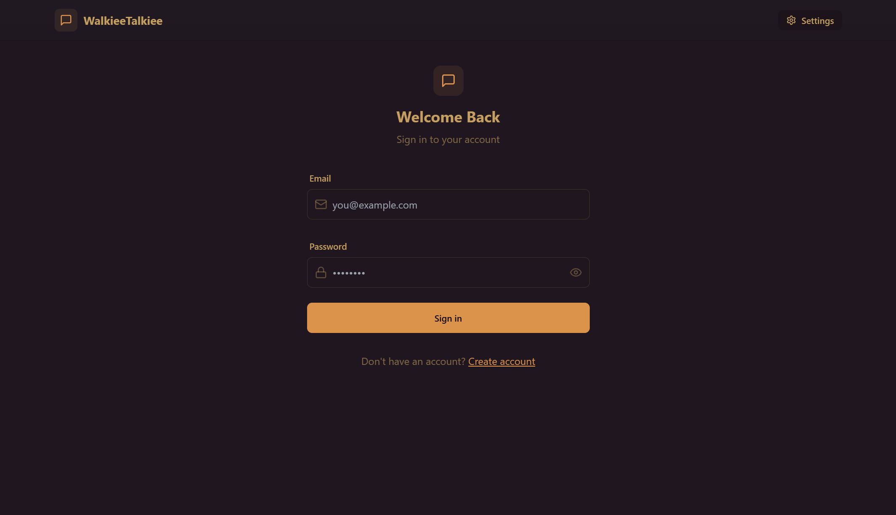
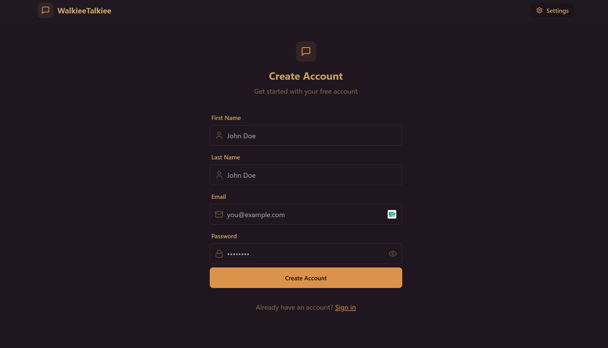
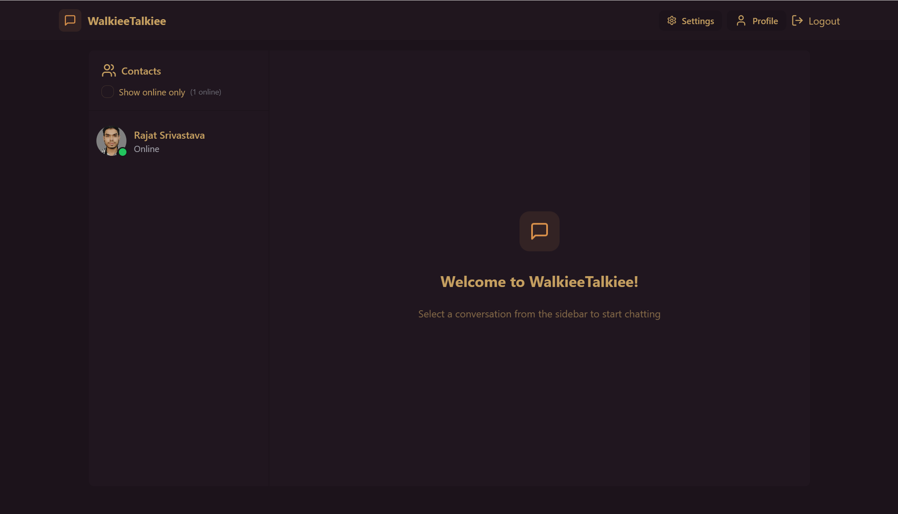
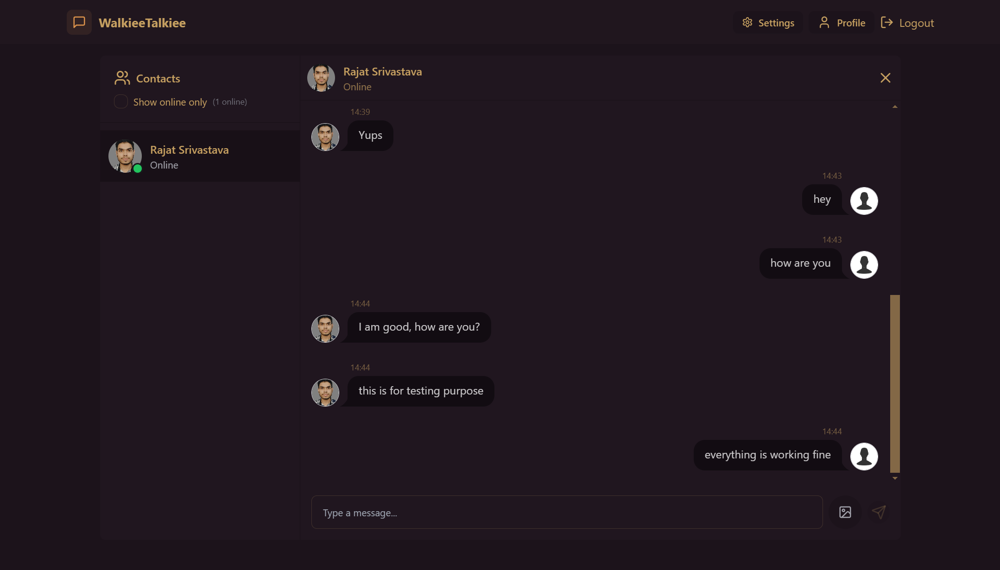
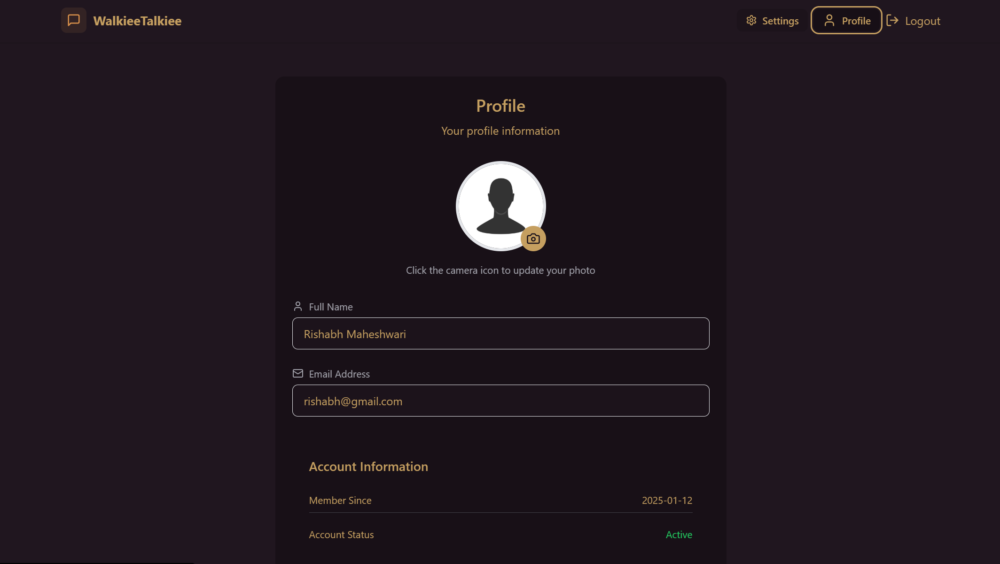
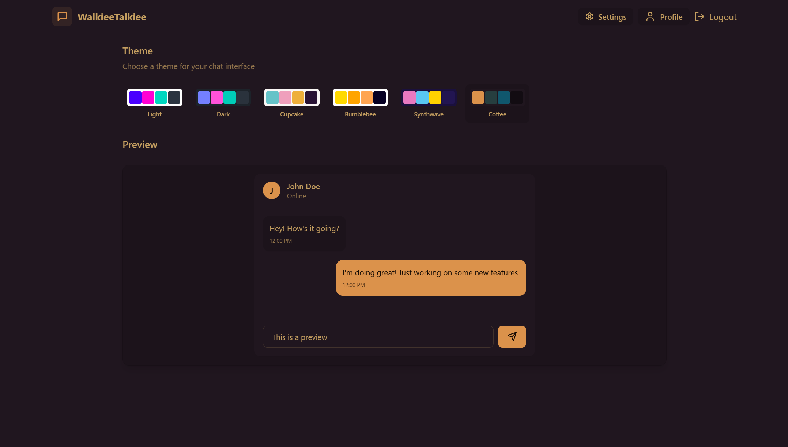

# Walkiee Talkiee

## Description
Walkiee Talkiee is a real-time chat application designed to provide seamless and secure communication between users. Built with modern web technologies, it enables users to connect, share messages, and upload media efficiently. Its user-friendly interface and robust backend make it a perfect solution for instant messaging needs.

---

## Video Demo
Check out the live demo of Walkiee Talkiee:  
[[Walkiee Talkiee Demo]](https://www.loom.com/share/3c13744f0abf4b298de1a6ef098ac765)

---

## Website Link
[[Project]](https://chat-application-kajc.onrender.com)

---

## Features
1. **Authentication:**
   - User signup and login using email and password.
   - Secure token-based authentication (JWT).

2. **Real-time Messaging:**
   - Send and receive messages instantly.

3. **Media Uploads:**
   - Send and display images within chats.
   - Media uploads managed via Cloudinary for optimized performance.

4. **User Presence:**
   - Track and display online users in real time.

5. **User Profiles:**
   - Update profile pictures and view account information.
   - Member since details and account activity tracking.

6. **Responsive Design:**
   - Fully optimized for desktop and mobile devices.

7. **Error Handling:**
   - Comprehensive error messages and fallbacks for smoother UX.

8. **Multiple Themes:**
   - Comes with mutiple themes for better UI.

---

## Tech Stack
### Frontend
- React with Vite
- State management via Zustand
- TailwindCSS for styling

### Backend
- Node.js with Express.js
- MongoDB for data storage
- Socket.IO for real-time communication
- Cloudinary for media storage

### Deployment
- Backend and Frontend are hosted on [Render](https://render.com).

---

## API Endpoints
### Authentication
1. **Signup:** `POST /api/auth/signup`
   - Fields: `firstName`, `lastName`, `email`, `password`, `profilePic` (optional)
2. **Login:** `POST /api/auth/login`
   - Fields: `email`, `password`
3. **Logout:** `POST /api/auth/logout`

### Profile
1. **Update Profile Picture:** `PUT /api/auth/updateProfile`
   - Fields: `profilePic`
2. **Check Auth Status:** `GET /api/auth/check`

### Messaging
1. **Send Message:** `POST /api/message/send/:id`
   - Fields: `text`, `image` (optional)
2. **Fetch Chat History:** `GET /api/messages/:id`
3. **Fetch Users:** `GET /api/messages/users`

### Sockets
- `connectSocket`: Initializes a user socket connection.
- `getOnlineUsers`: Receives the list of currently online users.

---

## Installation
### Prerequisites
- Node.js (v16 or above)
- MongoDB
- Cloudinary account

### Steps
1. Clone the repository:
   ```bash
   git clone https://github.com/your-repo/chat-app.git
   cd chat-app
   ```
2. Install dependencies:
   ```bash
   npm run build
   ```
3. Set up environment variables:
   - Create a `.env` file in the backend directory.
   - Add the following variables:
     ```env
     PORT=5001
     MONGO_URI=your_mongodb_connection_string
     JWT_SECRET=your_jwt_secret
     CLOUDINARY_NAME=your_cloudinary_name
     CLOUDINARY_API_KEY=your_api_key
     CLOUDINARY_API_SECRET=your_api_secret
     NODE_ENV=development
     ```
4. Start the application:
   - Backend:
     ```bash
     npm run start
     ```
---

## Screenshots
- 
- 
- 
- 
- 
- 

---

## Future Enhancements
1. Voice and Video Calling.
2. Group Chat Functionality.
3. Message Reactions.
4. End-to-End Encryption for chats.

---

## License
[MIT License](LICENSE)

---